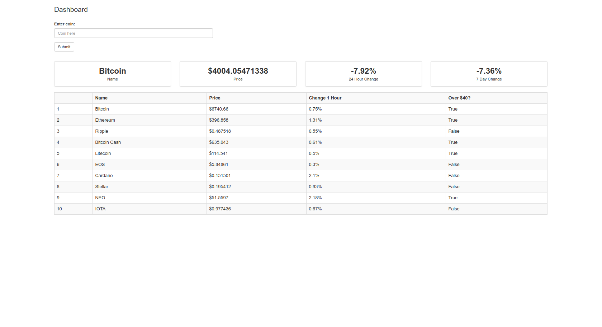

# Flask CoinMarketCap API Project

This projet is a part of my learning with Python 3 and frameworks, for this project I decided to get started with Flask, and develop a cryptocurrencies little website. Thanks to the **CoinMarketCap** API. And displaying the data in a table and allow the user to search any cryptocurrency and now the details.

## Used in this project

- Flask
- JSON
- Requests
- SQLite3
- Virtualenv

### Screenshot

This is what the project looks like

